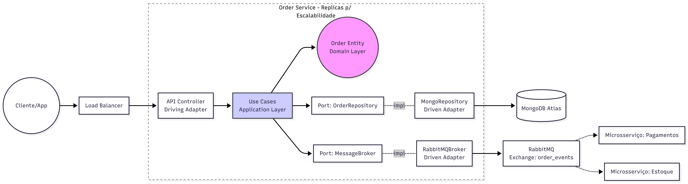

# Serviço de Gerenciamento de Pedidos E-commerce

Este projeto é um teste técnico para uma vaga de Desenvolvedor Backend Sênior. Ele implementa um serviço backend robusto, escalável e bem arquitetado para o gerenciamento de pedidos de e-commerce.

## Stack Tecnológica

- **Runtime:** Node.js
- **Framework:** Express.js
- **Banco de Dados:** MongoDB (com Mongoose)
- **Mensageria:** RabbitMQ (com amqplib)
- **Testes:** Jest (com Supertest)
- **Infraestrutura:** Docker & Docker Compose
- **Ferramentas de Qualidade:** ESLint, Prettier, Husky, lint-staged

## Arquitetura e Decisões Técnicas

O projeto segue estritamente a **Arquitetura Hexagonal (Ports and Adapters)** para garantir que a lógica de negócio principal esteja isolada de dependências externas e preocupações de infraestrutura.

### Decisões Chave

1.  **Arquitetura Hexagonal:**
    *   **Isolamento do Domínio:** A camada `src/domain` contém entidades puras e lógica de validação com zero dependências externas (sem Mongoose, sem Express).
    *   **Portas e Adaptadores:** Interfaces (`src/domain/ports`) definem como o domínio interage com o mundo. Implementações concretas (`src/infrastructure`) adaptam essas portas para tecnologias específicas (Mongoose, RabbitMQ).

2.  **Injeção de Dependência (DI):**
    *   Os Controllers não instanciam suas dependências. Em vez disso, um Container de DI leve (`src/infrastructure/di/container.js`) injeta repositórios e serviços. Isso melhora a testabilidade e o desacoplamento.

3.  **Data Mappers:**
    *   Um `OrderMapper` é utilizado para converter explicitamente entre modelos de persistência do Mongoose e Entidades de Domínio. Isso previne "vazamento de abstrações", onde campos específicos do banco de dados (como `_id` ou `__v`) poderiam poluir a lógica de domínio.

4.  **Logs Estruturados:**
    *   O `Winston` é utilizado para logs estruturados em formato JSON, essencial para observabilidade em ambientes de microsserviços.

5.  **Otimização de Performance:**
    *   O adaptador RabbitMQ implementa uma estratégia de conexão persistente (padrão Singleton para conexão/canal) para evitar o custo de estabelecer um novo handshake para cada mensagem publicada.

6.  **Tratamento Global de Erros:**
    *   Um Middleware de Tratamento de Erros centralizado captura exceções e padroniza as respostas da API, garantindo que os clientes sempre recebam payloads de erro em JSON consistentes.

### Estrutura

- `src/domain`: Contém entidades (`Order.js`) e portas (`OrderRepository.js`).
- `src/application`: Contém casos de uso (`CreateOrder`, `GetOrder`) que orquestram a lógica de domínio.
- `src/infrastructure`:
  - `database`: Modelos do MongoDB.
  - `mappers`: Converte entre modelos de Persistência e Domínio.
  - `messaging`: Adaptador RabbitMQ.
  - `repositories`: Implementação de repositório baseada em Mongoose.
  - `web`: Controllers, rotas e middlewares da API REST.
  - `di`: Container de Injeção de Dependência.

### Diagrama de Arquitetura



A solução adota a **Arquitetura Hexagonal** para isolar o Domínio da infraestrutura. O tráfego entra via um **Load Balancer**, garantindo escalabilidade horizontal entre réplicas. Os Controllers (Driving Adapters) acionam os Casos de Uso na camada de Aplicação, que orquestram a regra de negócio dentro da Entidade.

A comunicação externa ocorre exclusivamente via **Portas** (interfaces): o Repositório persiste dados no **MongoDB Atlas** e o Broker publica eventos no **RabbitMQ** (exchange `order_events`). Isso garante desacoplamento total, permitindo que microsserviços consumidores (Pagamentos/Estoque) reajam assincronamente às mudanças de status do pedido sem bloquear a API principal.

## Cobertura de Testes

O projeto mantém um alto padrão de qualidade de código com **>90% de cobertura de testes** em todas as camadas.

- **Testes Unitários:** Cobrem Entidades de Domínio, Casos de Uso, Repositórios e Adaptadores isoladamente.
- **Testes de Integração:** Verificam o fluxo completo desde o Controller da API até a infraestrutura mockada.

**Cobertura Atual:** ~92% statements.

Para rodar os testes:
```bash
npm test
```

Para ver o relatório de cobertura:
```bash
npm run test:cov
```

## Como Iniciar

### Pré-requisitos

- Docker e Docker Compose
- Node.js (v18+)

### Configuração e Execução

1. **Clone o repositório.**
2. **Inicie a infraestrutura (MongoDB & RabbitMQ):**
   ```bash
   docker-compose up -d
   ```
3. **Instale dependências locais (opcional, para desenvolvimento local):**
   ```bash
   npm install
   ```
4. **Execute a aplicação:**
   - via Docker: `docker-compose up -d --build`
   - via Node Local: `npm run dev` (Certifique-se de que MongoDB/RabbitMQ estão acessíveis em localhost)

### Endpoints da API

Você pode usar o arquivo `requests.http` incluído com a extensão REST Client do VS Code para testar a API.

- **Healthcheck:** `GET /health`
- **Criar Pedido:** `POST /orders`
- **Buscar Pedido:** `GET /orders/:id`
- **Atualizar Status:** `PATCH /orders/:id/status`
